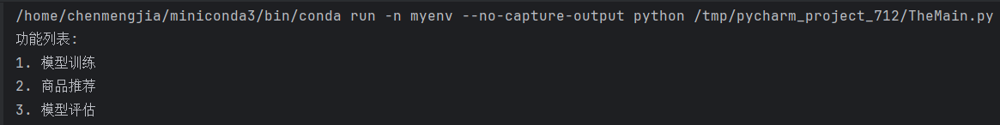
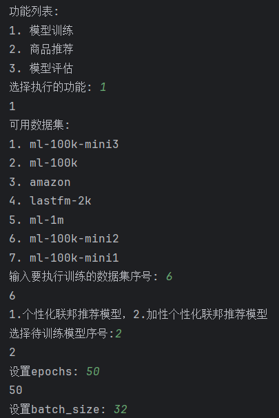
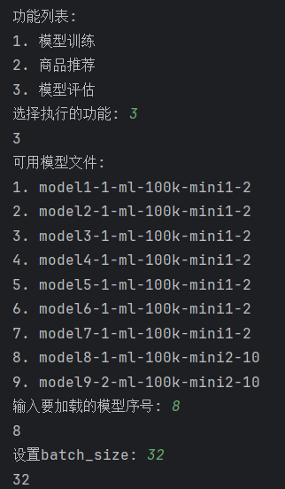
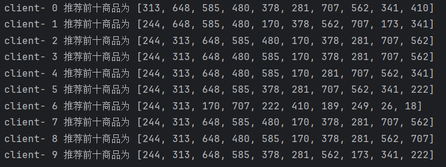
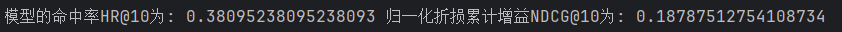

# 基于隐语的隐私保护推荐系统

## 项目介绍

本项目旨在开发一个轻量化、强化个性化的联邦推荐系统，以克服现有系统中模型复杂度高和个性化不足的问题。
基于隐语平台，实现了个性化联邦推荐算法，具备模型训练、商品推荐和模型评估三大功能。

## 目录

1. [总体介绍](#总体介绍)
   - [背景](#11-背景)
   - [目标](#12-目标)
   - [创新点](#13-创新点)
   - [技术实现方案](#14-技术实现方案)
   - [预期成果](#15-预期成果)
2. [技术实现过程](#技术实现过程)
   - [隐语技术](#21-隐语技术)
   - [算法模型](#22-算法模型)
   - [数据处理方法](#23-数据处理方法)
3. [效果展示](#效果展示)

## 总体介绍

### 1.1 背景

联邦推荐是新的互联网应用服务架构，旨在保护用户隐私的同时提供个性化推荐服务。

### 1.2 目标

- 轻量化模型：在用户设备上部署轻量级模型，减少对服务器通信的依赖。
- 增强个性化：通过改进项目嵌入和评分函数模块，提升推荐精度。

### 1.3 创新点

- 基于隐语平台的定制化联邦学习模型。
- 轻量化、个性化推荐模型。
- 双模型设计。

### 1.4 技术实现方案

采用个性化的项目嵌入模块和个性化的评分函数模块，实现模型的轻量级和个性化。

### 1.5 预期成果

使用隐语搭建推荐模型，该模型是轻量级模型，运行在用户本地，无需同服务器进行通信便可以针对用户进行个性化的推荐。

## 技术实现过程

### 2.1 隐语技术

采用隐语的水平联邦模型和安全聚合技术，通过继承隐语的FLModel类，重写其fit()方法，实现了选择性参数聚合和个性化训练。

### 2.2 算法模型

- **模型一**: 个性化的项目嵌入模块和评分函数模块。
- **模型二**: 全局项目嵌入模块、个性化项目嵌入模块和评分函数模块。

### 2.3 数据处理方法

使用MovieLens-100K、MovieLens-1M、Lastfm-2K和Amazon-Video数据集，采用隐式推荐的方法，设置正样本和负样本，进行模型训练和评估。

## 效果展示

- **主界面**: 提供模型训练、商品推荐、模型评估三个功能。
  <div style="text-align: left;">
  
   </div>
- **模型训练**: 选择数据集和模型，设置epochs和batch_size进行训练。
  <div style="text-align: left;">
  
   </div>
   <div style="text-align: left;">
  
   </div>
- **商品推荐**: 选择模型进行加载，设置推荐商品范围和batch_size进行推荐。
  <div style="text-align: left;">
  
   </div>
   <div style="text-align: left;">
  
   </div>
   <div style="text-align: left;">
  
   </div>
- **模型评估**: 选择模型进行加载，设置batch_size进行评估。
  <div style="text-align: left;">
  
   </div>
   <div style="text-align: left;">
  
   </div>
   <div style="text-align: left;">
  
   </div>

## 贡献

欢迎对本项目进行贡献，包括但不限于：

- 功能增强
- 代码优化
- 文档完善

## 许可证

本项目采用[MIT许可证](LICENSE)。

### 安装
通过docker配置隐语环境即可，运行SecretFlow的docker image命令为
```bash 
docker run -it secretflow/secretflow-anolis8:latest
```
### 运行
运行TheMain.py即可
